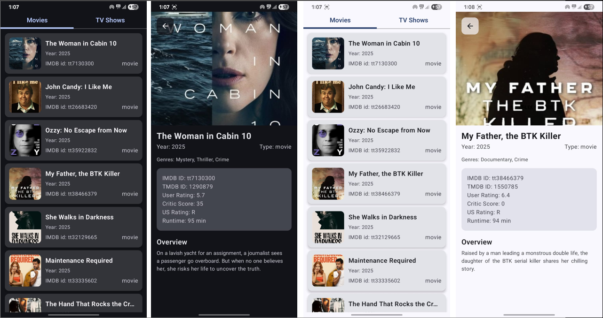

# Vijay WFH Assignment

A **Jetpack Compose** based Android application that lists **Movies and TV Shows** using the [WatchMode API](https://api.watchmode.com/). Users can view details of a selected media with images, metadata, and overview.

---

## Features

- Display movies and TV shows in a tabbed interface.
- Click on any item to view detailed information.
- Data-driven **ViewModel** using **RxJava3** and **StateFlow**.
- Smooth **shimmer loading** for better UX.
- Image loading with **Coil**.
- Type-safe navigation using Kotlin Serialization.
- Fully responsive **Jetpack Compose UI**.

---

## Screenshots



---

## Tech Stack

- **Kotlin**
- **Jetpack Compose**
- **RxJava3**
- **Coil** (for image loading)
- **Koin** (for dependency injection)
- **Retrofit** (for API calls)
- **WatchMode API**

---

## Installation

1. Clone the repository:

```bash
git clone https://github.com/yourusername/vijayiwhf-assignment.git
```

- Add API_KEY and BASE_URL in `local.properties` file.
- Enjoy your project.